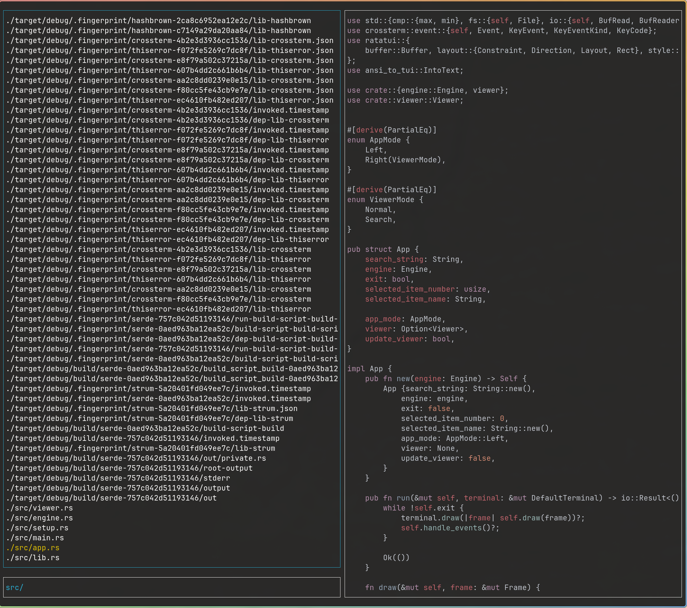
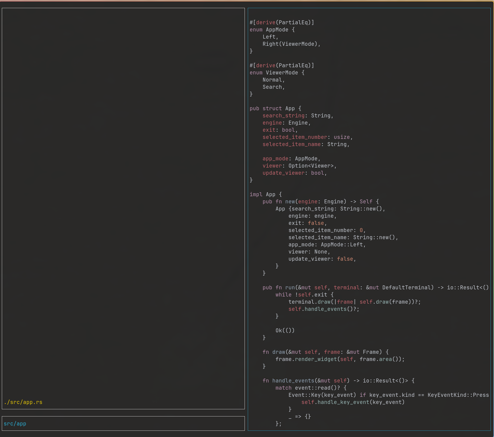

# My fzf (TUI File Explorer)

A terminal-based file explorer and fuzzy finder written in **Rust**, built with **Ratatui**. 
Unlike standard `fzf`, this tool focuses on file navigation and previewing. It features a split-pane interface with real-time filtering, syntax-highlighted previews, and Vim-style navigation.

--- 

## Features
* **Split-pane Layout:** Browse the file list on the left, preview content on the right.
* **Fuzzy Search:** Rapidly filter files.
* **Syntax Highlighting:** Automatic syntax coloring for previews in the right.
* **Dual Modes:** Switch focus between the file list (filtering) and the preview pane (reading).
* **Vim-like Navigation:** Search within the previewed file using `/`, `n`, and `N`.

---

## How to run project

    cargo run . 

--- 

## Example view

